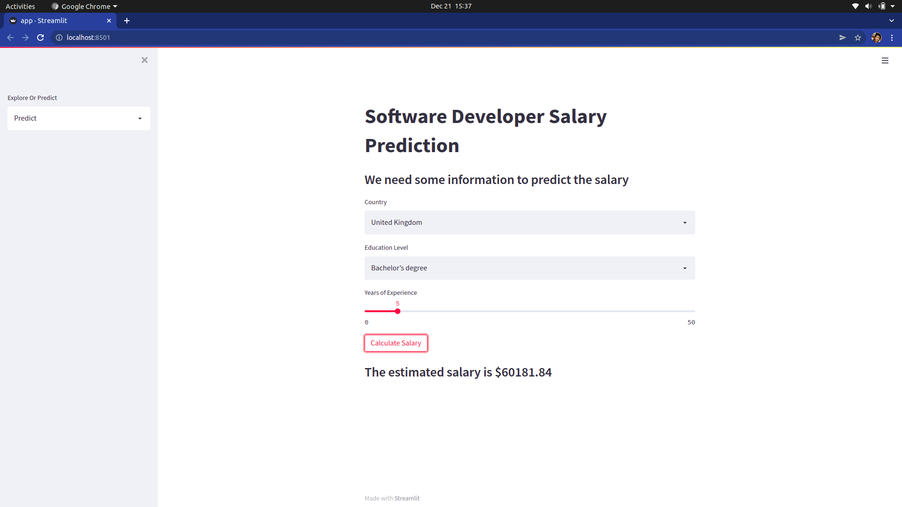
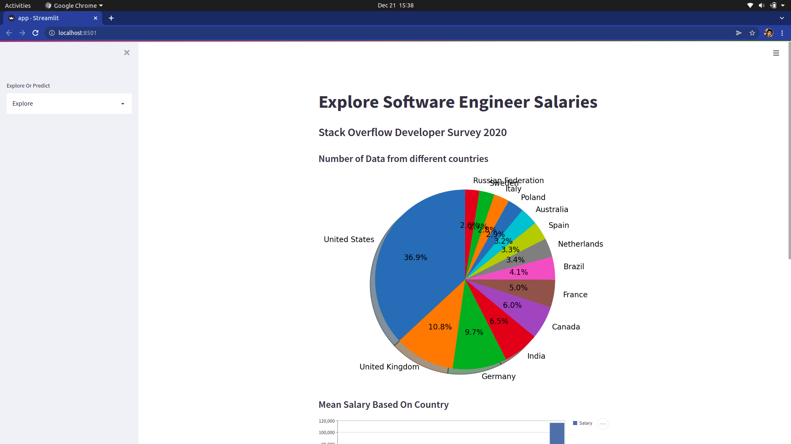
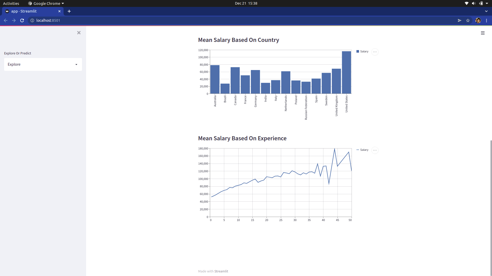

# Software Developer Salary Prediction

This web application is designed to predict salary of software developers across various countries, depending upon different parameters such as:

- Nation
- Education level
- Years of experience

 

 
 

I have used streamlit, which is a python library that helps to make frontend and showcase the results easily and in a systematic manner.

 
 

### Preprocessing and ML model

Out of all, only three main features are taken to calculate the value.

Various methods such as LinearRegression, DecisionTressRegressor and RandomForestRegressor are used for better results.

 
 

## Data from various Countries
 

 
 

## Salary graph according to Demography

MeanSquaredError is used for correctneess and optimization.
 

## Conclusion

The annual salaray is dependent upon Country and years of experience, and has less effect from education level. 

